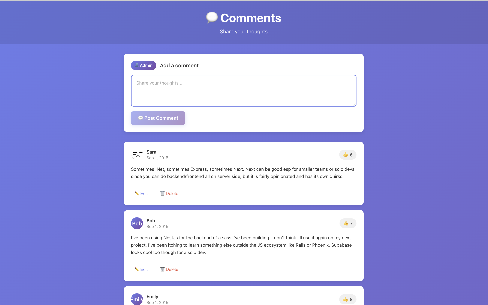

# Bobyard Comment System - Fullstack Challenge

A YouTube/Reddit-style comment system built with Django REST Framework (backend) and React (frontend).



## Time & Approach

**Time spent:** ~2 hours as requested

**What I built:**
- **RESTful API** with **Django** REST Framework & **PostgreSQL**
- Full **CRUD** operations
- React frontend with clean, modern UI
- Comprehensive error handling
- Detailed API documentation

**Design decisions:**

- Frontend uses PATCH for updates (simpler, only updates text field)
- Backend supports both PUT/PATCH per REST API standards
- Relative time display (e.g., "2 hours ago") for better UX
- Admin as default user for new comments
- Empty state handling and loading states
- Image state handling

## Features

### Backend (Django REST Framework + PostgreSQL)
- RESTful API for comment management
- Full CRUD operations (Create, Read, Update, Delete)
- PostgreSQL database integration
- Comprehensive error handling and validation
- Admin interface for data management
- CORS enabled for frontend integration
- Data seeding from JSON file

### Frontend (React)
- Display comments with author, text, date, likes, and images
- Add new comments
- Edit existing comments
- Delete comments
- Clean, modern UI design

## Tech Stack

**Backend:**
- Python 3.x
- Django 4.2.7
- Django REST Framework 3.14.0
- PostgreSQL
- django-cors-headers

**Frontend:**
- React.js

## Project Structure

```
bobyard-comment/
├── backend/                      # Django backend application
│   ├── comments/                 # Comments Django app
│   │   ├── management/
│   │   │   └── commands/
│   │   │       └── load_comments.py  # Custom command to load JSON data
│   │   ├── migrations/
│   │   │   └── 0001_initial.py   # Database migrations
│   │   ├── __init__.py
│   │   ├── admin.py              # Django admin configuration
│   │   ├── apps.py               # App configuration
│   │   ├── models.py             # Comment model definition
│   │   ├── serializers.py        # DRF serializers
│   │   ├── tests.py              # Unit tests
│   │   ├── urls.py               # App URL patterns
│   │   └── views.py              # API viewsets
│   ├── comments_project/         # Django project settings
│   │   ├── __init__.py
│   │   ├── asgi.py               # ASGI configuration
│   │   ├── settings.py           # Project settings
│   │   ├── urls.py               # Main URL configuration
│   │   └── wsgi.py               # WSGI configuration
│   ├── data/
│   │   └── comments.json         # Sample seed data
│   ├── manage.py                 # Django management script
│   ├── requirements.txt          # Python dependencies
│   ├── setup.sh                  # Automated setup script
│   └── .env.example              # Environment variables template
├── frontend/                     # React frontend application
│   ├── public/
│   │   └── index.html            # HTML template
│   ├── src/
│   │   ├── components/
│   │   │   ├── CommentForm.js    # Form to add new comments
│   │   │   ├── CommentForm.css   # Form styles
│   │   │   ├── CommentItem.js    # Individual comment display
│   │   │   ├── CommentItem.css   # Comment item styles
│   │   │   ├── CommentList.js    # List of all comments
│   │   │   └── CommentList.css   # List styles
│   │   ├── services/
│   │   │   └── api.js            # Axios API client
│   │   ├── App.js                # Main application component
│   │   ├── App.css               # App styles
│   │   ├── index.js              # React entry point
│   │   └── index.css             # Global styles
│   ├── node_modules/             # Frontend dependencies
│   ├── package.json              # Node.js dependencies and scripts
│   └── pnpm-lock.yaml            # Dependency lock file
└── README.md                     # Project documentation
```

## Getting Started

### Prerequisites

- Python 3.8 or higher
- PostgreSQL 12 or higher
- Node.js 14 or higher (for frontend)
- pip (Python package manager)

### Backend Setup

#### 1. Navigate to the backend repo

```bash
cd bobyard-comment/backend
```

#### 2. Install dependencies

```bash
pip install -r requirements.txt
```

#### 3. Set up PostgreSQL database

Create a PostgreSQL database:

```sql
psql postgres -c "CREATE DATABASE comments_db;"
```

#### 4. Configure environment variables

Edit `.env` with your database credentials:

```env
SECRET_KEY=your-secret-key-here
DEBUG=True
ALLOWED_HOSTS=localhost,127.0.0.1

# Database Configuration
DB_NAME=comments_db
DB_USER=your-user-name
DB_PASSWORD=your_password
DB_HOST=localhost
DB_PORT=5432
```

#### 5. Run migrations

```bash
python manage.py makemigrations
python manage.py migrate
```

#### 6. Load initial data

```bash
# Load from default location (backend/data/comments.json)
python manage.py load_comments
```

#### 7. Start the development server

```bash
python manage.py runserver
```

The API will be available at `http://localhost:8000/`

### Frontend Setup

```bash
cd frontend
pnpm install
pnpm start
```

## API Endpoints

Base URL: `http://localhost:8000/api/`

### Comments

| Method | Endpoint | Description |
|--------|----------|-------------|
| GET | `/api/comments/` | List all comments |
| GET | `/api/comments/{id}/` | Get a specific comment |
| POST | `/api/comments/` | Create a new comment |
| PUT | `/api/comments/{id}/` | Update a comment (full update) |
| PATCH | `/api/comments/{id}/` | Partial update a comment |
| DELETE | `/api/comments/{id}/` | Delete a comment |

### API Request/Response Examples

#### List all comments
```bash
curl http://localhost:8000/api/comments/
```

#### Get a specific comment
```bash
curl http://localhost:8000/api/comments/1/
```

#### Create a new comment
```bash
curl -X POST http://localhost:8000/api/comments/ \
  -H "Content-Type: application/json" \
  -d '{
    "text": "This is a new comment",
    "author": "Admin",
    "likes": 0,
    "image": ""
  }'
```

#### Update a comment
```bash
curl -X PATCH http://localhost:8000/api/comments/1/ \
  -H "Content-Type: application/json" \
  -d '{
    "text": "Updated comment text"
  }'
```

#### Delete a comment
```bash
curl -X DELETE http://localhost:8000/api/comments/1/
```
### Response Format

**Success Response (Single Comment):**
```json
{
  "id": 1,
  "author": "Joe",
  "text": "This is a comment",
  "date": "2015-09-01T12:00:00Z",
  "likes": 101,
  "image": "https://example.com/image.jpg"
}
```

**Success Response (List):**
```json
[
  {
    "id": 1,
    "author": "Joe",
    "text": "This is a comment",
    "date": "2015-09-01T12:00:00Z",
    "likes": 101,
    "image": "https://example.com/image.jpg"
  },
  ...
]
```

**Error Response:**
```json
{
  "error": "Error message description"
}
```

